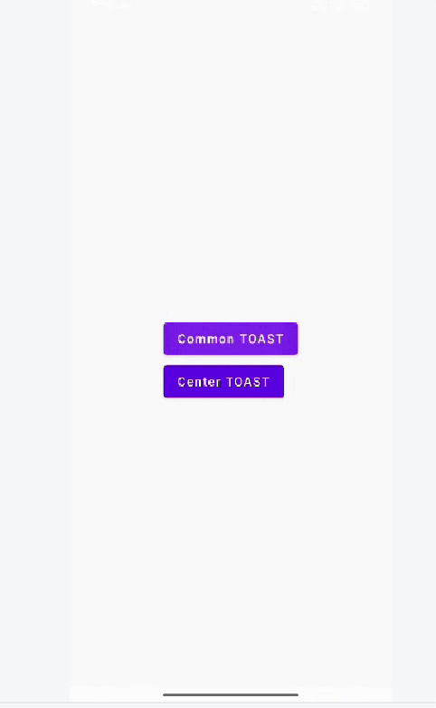
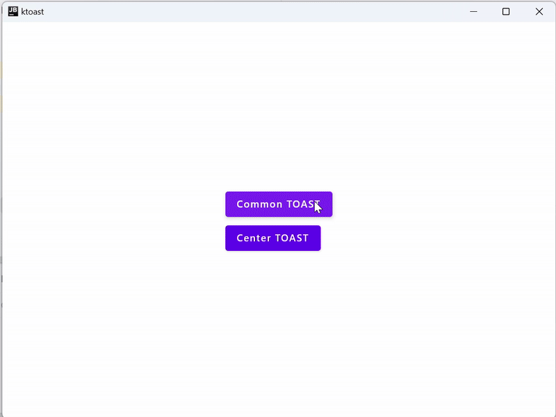
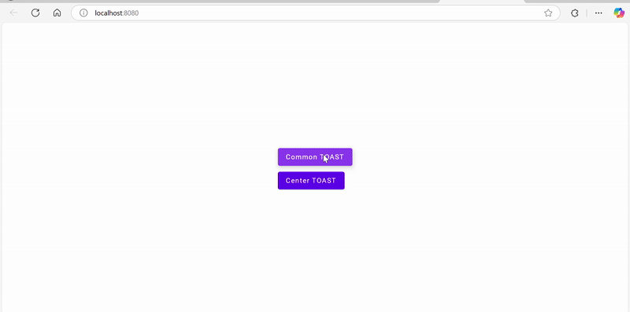

# 🔔 KToast

[](https://central.sonatype.com/artifact/io.github.tarifchakder.ktoast/ktoast)
[](LICENSE)
[](https://kotlinlang.org)
[](https://github.com/JetBrains/compose-multiplatform)


---

## ✨ Overview

**KToast** is a lightweight toast/notice library built for **Compose Multiplatform**. It gives you a simple, unified API to show toasts across **Android**, **iOS**, **Desktop (JVM)**, and **Web/Wasm**—with sensible defaults and smooth transitions.

---

## 🖥️ Demo

|              Android              |              Desktop               |            Web             |            IOS             |
|:---------------------------------:|:----------------------------------:|:--------------------------:|:--------------------------:|
|  |  |  |  |

---

## 📦 Features

- ⚡ **Cross-platform**: Android, iOS, Desktop (JVM), Web/Wasm
- 🎛️ **Simple API**: one `ToastState` you can pass around
- 🎨 **Composable** host: place it anywhere in your layout
- 🌀 **Transitions**: slide/fade presets via `ToastDefaults`
- 🧱 **Works with your theme**: drop into any Material setup

---

## 🚀 Installation

Add KToast to your **multiplatform** project by depending on it from `commonMain`.

### Gradle (Kotlin DSL)

```kotlin
kotlin {
    sourceSets {
        commonMain {
            dependencies {
                implementation("io.github.tarifchakder.ktoast:ktoast:1.0.0")
            }
        }
    }
}
```
### Version Catalog

```toml
[versions]
toast = "1.0.0"

[libraries]
k-toast = { module = "io.github.tarifchakder.ktoast:ktoast", version.ref = "toast" }
```

## Usage

```Kotlin
// Create toast state
val toast = ToastState()
```
```kotlin
MaterialTheme {
  Box {
    ToastHost(
      modifier = Modifier.fillMaxSize().padding(20.dp),
      alignment = Alignment.BottomCenter,
      hostState = toast,
      transitionSpec = { ToastDefaults.SLIDE }
    )
  }
}
```

```Kotlin
// Now call it anywhere
toast1.showToast("Hi this is a common toast")
```
## 🤝 Contributing
Issues and PRs are welcome!
If you’d like to add features or fix bugs, please open an issue first so we can discuss scope and approach.
## License
This project is distributed under the MIT License.
[LICENSE](LICENSE) 


